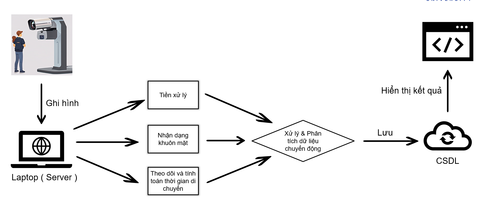
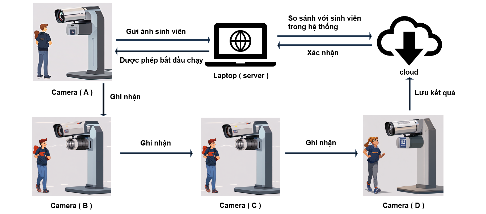

# 🎯 Face Recognition and Movement Tracking System

<div align="center">
  
[](https://www.python.org/)
[](https://opencv.org/)
[](https://flask.palletsprojects.com/)
[](LICENSE)

🚀 An intelligent surveillance system using face recognition and motion detection to track user movement across 3 cameras, featuring real-time web interface and sound alerts.

</div>

## 📝 System Diagram

<div align="center">
  
</div>

## ✨ Highlighted Features

### 🎭 Face Recognition
- 🧠 Uses ResNet model for face feature extraction
- 👥 Supports multiple faces in single frame
- 🎯 High accuracy with 0.5 matching threshold
- 📚 Easy training with custom dataset

### 🎬 Motion Detection
- 📹 Uses MOG2 Background Subtraction algorithm
- 🎛️ Customizable motion detection threshold
- 🔍 Efficient noise and shadow handling

### 📸 Multi-Camera Surveillance
- 🎥 Camera A: Face recognition
- 📹 Cameras B & C: Motion detection
- ⏱️ Time synchronization between cameras

### 🖥️ Web Interface
<div align="center">
  
</div>

Features:
- 📺 Live video streams from 3 cameras
- ⚡ Real-time status updates
- ⏲️ Travel time display between points
- 🏁 Cycle completion notifications

### 🔔 Smart Alerts
- 🚨 Sound alerts for exceeded travel time
- 🔈 "Ting" notification for too fast movement
- 💾 Movement data storage to MockAPI

## 🛠️ System Requirements

### 💻 Hardware
- 3️⃣ IP cameras (RTSP/HTTP stream support)
- 📊 Recommended resolution: 160x120 pixels
- 🌐 Stable network connection

### 📦 Software Dependencies
```bash
python>=3.6         # 🐍 Core runtime
face_recognition    # 👤 Face detection & recognition
opencv-python>=4.0  # 📸 Image processing
flask>=2.0         # 🌐 Web framework
pygame             # 🔊 Audio playback
numpy              # 🔢 Numerical operations
pillow            # 🖼️ Image handling
requests          # 🌍 HTTP client
```

## 🚀 Quick Start

### 1️⃣ Environment Setup
```bash
# 🏗️ Create virtual environment
python -m venv venv

# 🌟 Activate virtual environment
source venv/bin/activate  # 🐧 Linux/Mac
venv\Scripts\activate     # 🪟 Windows

# 📦 Install dependencies
pip install -r requirements_dev.txt
```

### 2️⃣ Camera Configuration
```python
# 🎥 In demo.py
CAM_A_IP = 'http://192.168.1.101:4747/video'  # 👤 Face recognition
CAM_B_IP = 'http://192.168.1.102:4747/video'  # 📹 Motion detection 1
CAM_C_IP = 'http://192.168.1.110:4747/video'  # 🎥 Motion detection 2
```

### 3️⃣ Dataset Preparation
```plaintext
📁 dataset/
 ├── 👤 person1.jpg        # Filename is label
 ├── 👥 person2-name.jpg   # Part after hyphen is label
 └── ...
```

### 4️⃣ Model Training
```bash
# 🧠 Train face recognition model
python face_recognition_train.py
```

## ⚙️ System Configuration

### 🎛️ Key Parameters
```python
# ⏱️ Travel times (seconds)
max_travel_time = 5    # ⏰ Maximum between points
min_travel_time = 2    # ⌛ Minimum between points
min_valid_time = 0.5   # ✅ Minimum confirmation

# 👤 Face recognition
face_recognition_interval = 0.3  # 🔄 Scan frequency
face_recognition_tolerance = 0.5 # 🎯 Match threshold

# 📹 Motion detection
motion_threshold = 1.5  # 📊 Pixel change percentage
```

### 🌐 API Endpoints

| Endpoint | Description |
|----------|-------------|
| `GET /` | 🏠 Main web page |
| `GET /video_feed_[a\|b\|c]` | 📹 Camera streams |
| `GET /face_status` | 👤 Recognition status |
| `GET /current_time` | ⏱️ Cycle time |
| `GET /travel_time` | 🕒 Travel times |
| `GET /completion_status` | ✅ Cycle status |

## 🔄 Operation Process

### 1️⃣ System Startup
- 🎥 Initialize cameras
- 🧠 Load face model
- 🌐 Start web server

### 2️⃣ Surveillance Cycle
- 👤 Face verification
- ⏱️ Time counting
- 📹 Motion detection
- ✅ Return confirmation

### 3️⃣ Data Recording
```json
{
    "start_time": "2025-03-18T18:56:44",
    "end_time": "2025-03-18T18:57:11",
    "travel_time_a_b": 3.5,
    "travel_time_b_c": 4.2,
    "travel_time_c_a": 3.8
}
```

## 📜 License

See the [LICENSE](LICENSE) file for details.

## 🤝 Contributing

1. 🍴 Fork repository
2. 🌟 Create feature branch
3. ✍️ Commit changes
4. 📤 Push to branch
5. 📫 Create Pull Request

## 🔒 Safety Notes

- 🏢 Place cameras securely
- 🌐 Check network regularly
- 💾 Backup data periodically
- 🔑 Update security settings

---
<div align="center">
  
Made with ❤️ for security and efficiency

[⬆ Back to top](#-face-recognition-and-movement-tracking-system)

</div>